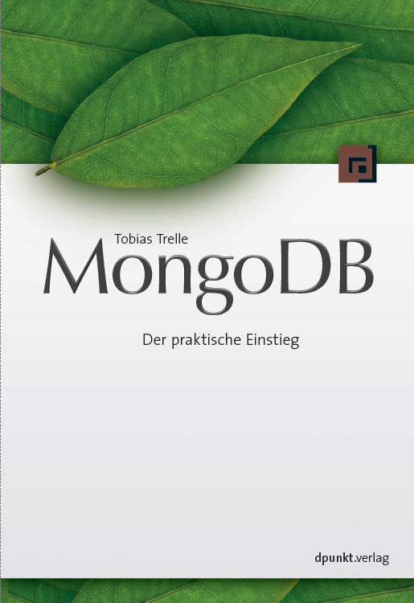

# MongoDB - Ein praktischer Einstieg #
In diesem Repository findet Sie den Sourcecode in [Java](java) und [Ruby](ruby	) sowie [Testdaten](data) zu den Programmierbeispielen aus meinen Buch
....

**MongoDB - Ein praktischer Einstieg** 
Tobias Trelle 
[dpunkt.verlag](http://www.dpunkt.de), 2014 
ISBN XYZ

Viel Spass beim Ausprobieren!

## Über den Autor ##
Dipl.-Math. Tobias Trelle ist Senior IT Consultant bei der codecentric AG, Solingen. Er ist seit knapp 20 Jahren im IT-Business unterwegs und interessiert sich für Software-Architekturen und skalierbare Lösungen. 

Tobias hält [Vorträge zu den Themen NoSQL und MongoDB](http://de.slideshare.net/tobiastrelle) auf [Konferenzen und Usergruppen](http://lanyrd.com/profile/tobiastrelle/), [bloggt](https://blog.codecentric.de/en/author/tobias-trelle/) und verfasst Artikel in Fachzeitschriften. Darüber hinaus organisiert die [Düsseldorfer MongoDB Usergruppe](https://www.xing.com/net/mongodb-dus/).

